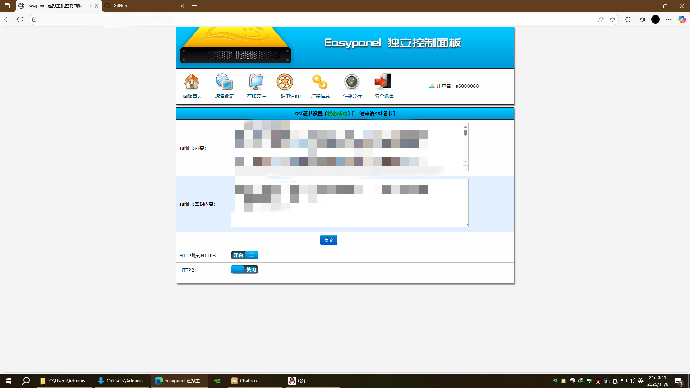
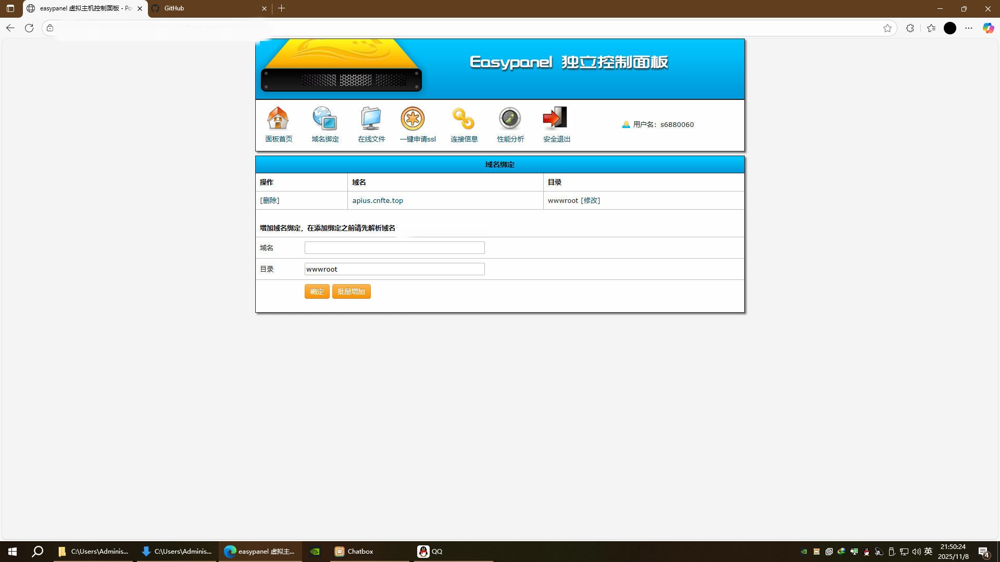
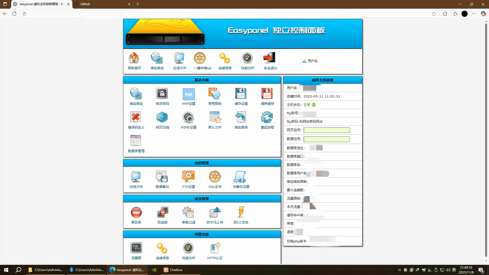
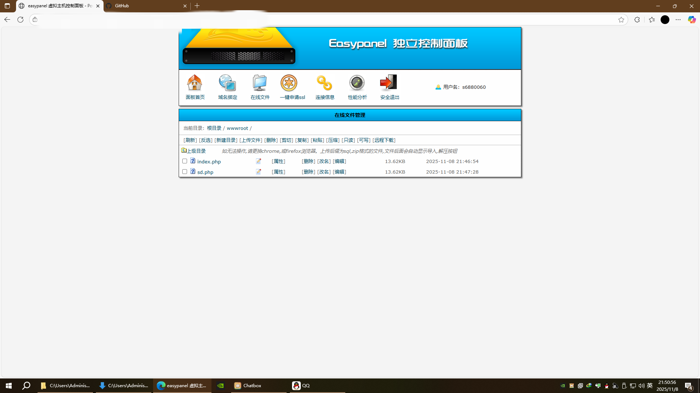
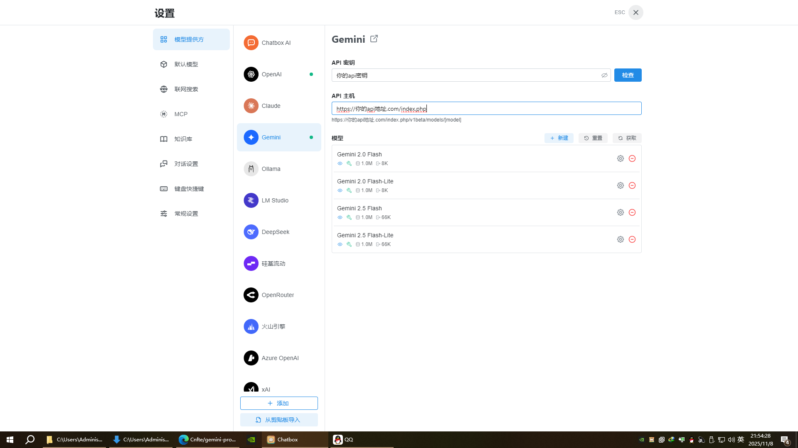
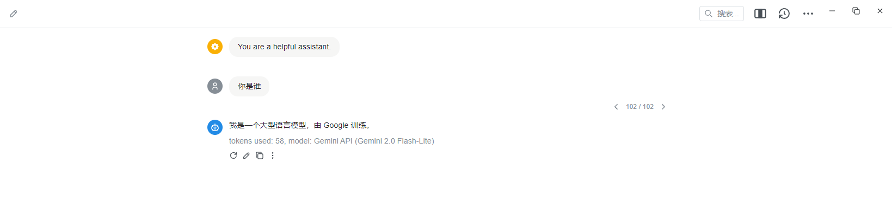

# geminiproxy for php

## 项目开发不易，希望各位高抬贵手点个免费的star吧

**一键部署 Gemini 反向代理，解决国内访问难题！**

### 核心优势

*   **极速部署：** 只需单个 PHP 文件，即可在 PHP 虚拟主机上快速搭建 Gemini 反向代理。
*   **广泛兼容：** 兼容 PHP 7.2 及以上版本，占用资源极少。
*   **网络优化：** 有效解决国内访问 Gemini 的网络连接问题，提升访问速度和稳定性。

### 重要前提 (务必注意!)

1.  **SSL 证书：** **必须提前准备好 SSL 证书**。这是保证安全连接的关键。
2.  **域名解析：** **务必将您的域名正确解析至服务器的公网 IP 地址**。否则无法访问。
3.  **功能说明：** 本脚本仅提供 Gemini 的反向代理功能，**不负责 Gemini API 格式转换为 OpenAI 格式**。  您需要自行处理格式转换。
4.  **客户端配置：** 配置完成后，在 Chatbox 等 AI 聊天软件中填入您的域名，即可与 Gemini 通信。

---

## 详细部署指南

### 1. 服务器准备

*   **海外服务器：** 必须是位于海外、且延迟较低、支持 SSL 证书和域名绑定的虚拟 PHP 主机（香港服务器不适用）。
*   **以下地区不适用：** 中国大陆、朝鲜、伊朗、古巴、叙利亚、苏丹、克里米亚、中国香港地区
### 2. 域名和 SSL 证书准备

*   **申请 SSL 证书：** 申请免费的 SSL 证书。
*   **绑定域名：** 将域名与服务器绑定，并正确配置 SSL 证书。

    

*   **解析域名：** 将域名解析到服务器的公网 IP 地址。

    

### 3. 部署步骤

*   **下载文件：** 从项目的 Releases 页面或项目根目录下载 `index.php` 文件（如果服务商有 PHP 检测，请使用 `hx_prxy.php`）。
*   **上传文件：** 登录虚拟主机管理面板，进入文件管理（此处以 easypanel 控制面板为例）。

    

*   **上传至目录：** 将下载的文件拖拽到与您的域名绑定的目录。

    

### 4. 完成

*   恭喜！ 代理服务器已经搭建完成。
*   **但是**如果有条件建议套层cdn提高访问速度，体验会更佳

### 5. 客户端配置

*   **指定文件名：** 在客户端（例如 Chatbox），必须明确指定 `index.php` 或 `hx_prxy.php`。 这样客户端才能正确连接到代理。

    

现在，您可以尽情享受与 Gemini 的畅快对话了！

